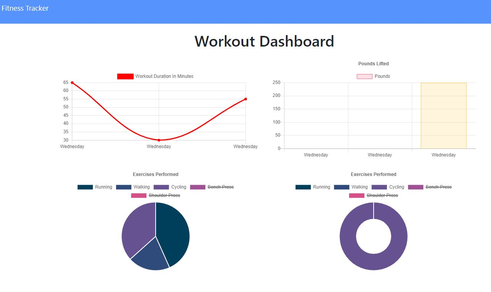

# Workout Tracker

## Description

This app lets the user to record workout they have completed, doing so allows them to see their full progress and see a visual chart of the breakdown of their activity. 

## Mock-Up

This is first look at what the app looks like

[I am a link to the web page](https://salty-sierra-79578.herokuapp.com/)

## Usage 

When the user vistis the page, they will be able to enter a new workout and selecting wether their workout is a cardio or a resistance workout. After selecting one, they will be able to create a label for the workout and some genaric information such as wieght/reps/duration. When all the data is entered for the workout, the user can either complete their sesion or add another exercise. When the workout is complete, they can click on the Dashboard txt in the upper left corner of the screan to view their full workout chart. 

## License

These files don't have a license and are there to fully share.

---